# Examen Parcial 2

### Carlos Andrés Cuéllar Velásquez 2497117
       
## a) Bitácora

1. Problema 2.

   1.1 Se hace la Class ArrayList que es la estructura elegida para implementar los datos previamente dados. 
   
   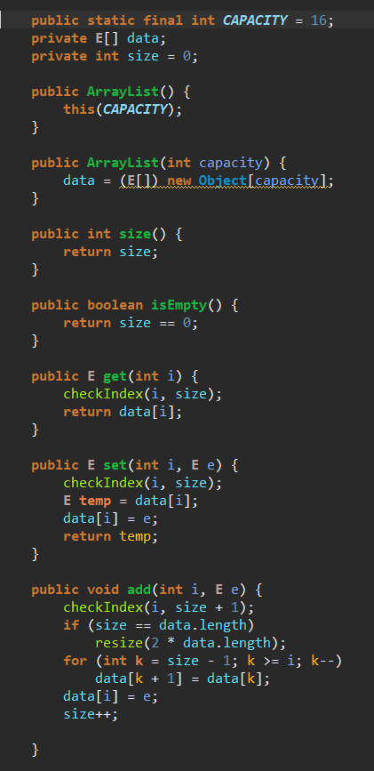
   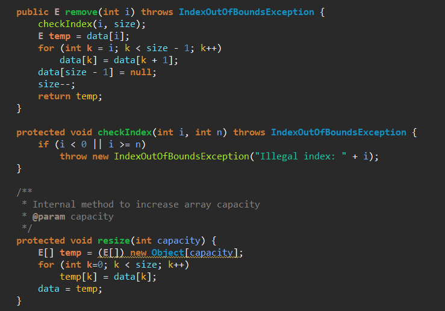
   
   1.2 En la clase Main se crea el objeto myList y se agregan los datos.
   
   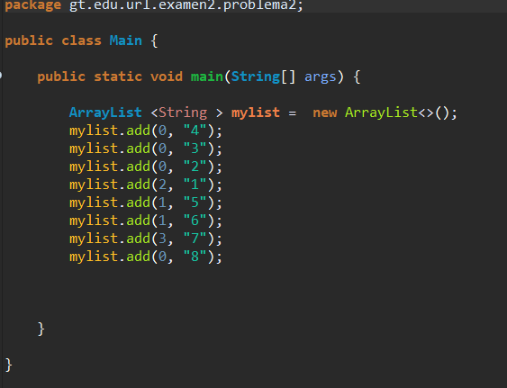
   
2. Problema 3.

   2.1 Se crea la clase Nodo y sus funciones. 
   
   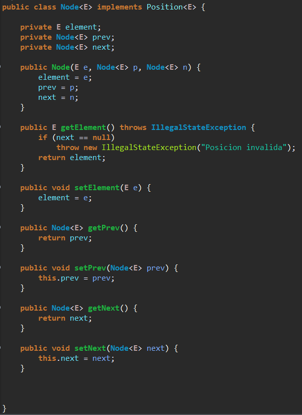
   
   2.2 Se crea la clase LinkedPositionalList y sus funciones. Aparte se agrega void swap(Position<E> p, Position<E> q) que es la funcion a implementar. 
   
   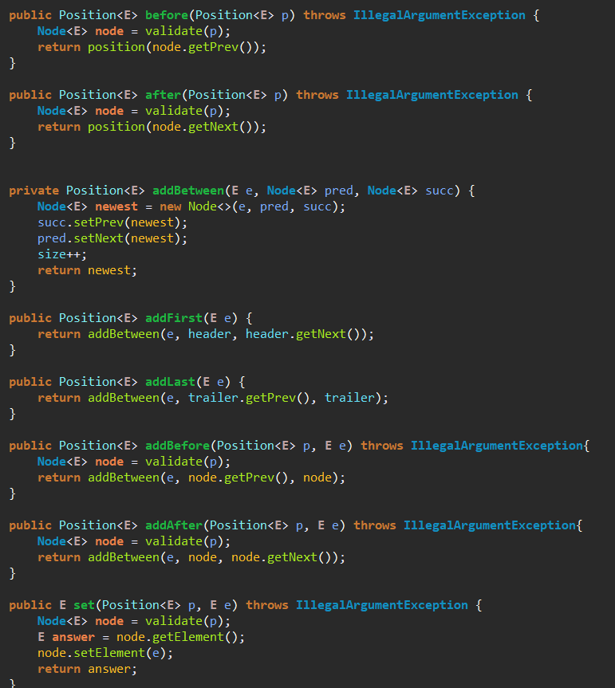
   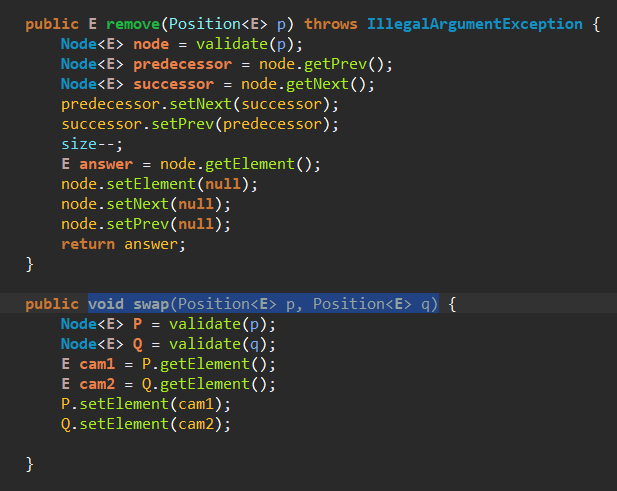
   
   2.3 Se crea el Main donde se ejecuta todos los comandos para hacer el swap. 
   
   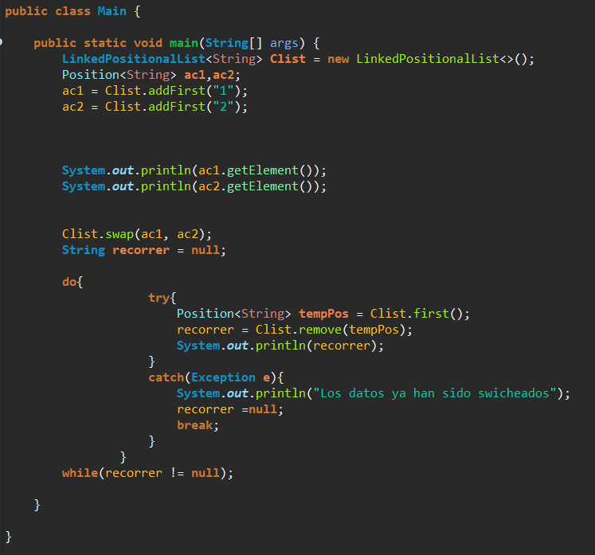
   
3. Problema 4.
       
   3.1 Se crea la clase Nodo y sus funciones. 
   
   
   
   3.2 Se crea la clase LinkedPositionalList y sus funciones. Aparte se agrega Position<E> positionAtIndex(int i).
   
   
   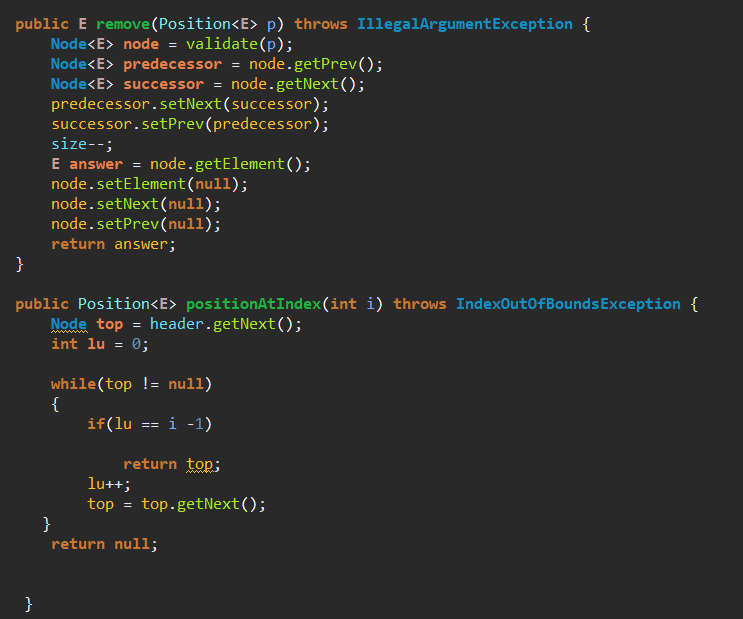
   
   3.3 Se crea el Main donde se ejecuta todos los comandos para hacer el index. 
   
   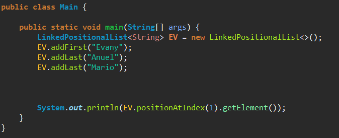
   
4. Problema 5.

   2.1 Se crea la clase Nodo y se delcaran los datos tipo nodos a utilizar.
   
   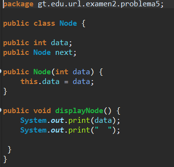
   
   2.2 Se crea la clase LinkList donde se hace todas las funciones de una lista enlazada normal. 
   
   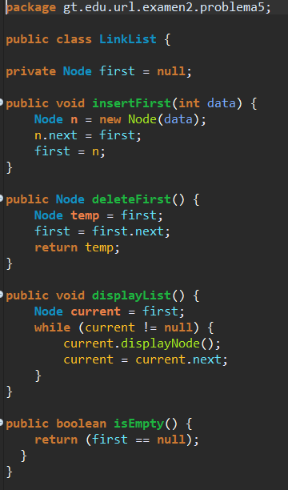
   
   2.3 Se crea la clase LinkListStack donde se hacen las funciones propias del Stack.
   
   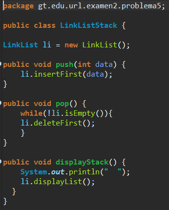
   
   2.4 En la clase Main se agregan los valores al Stack Dinamico. 
   
   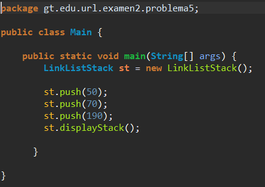
   
